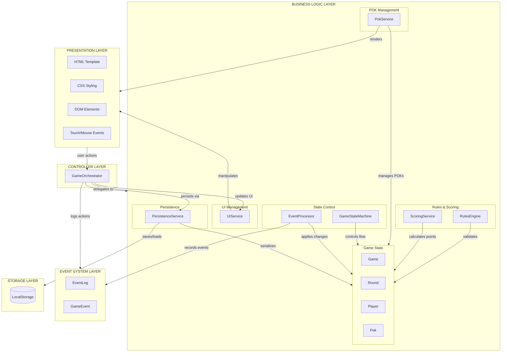
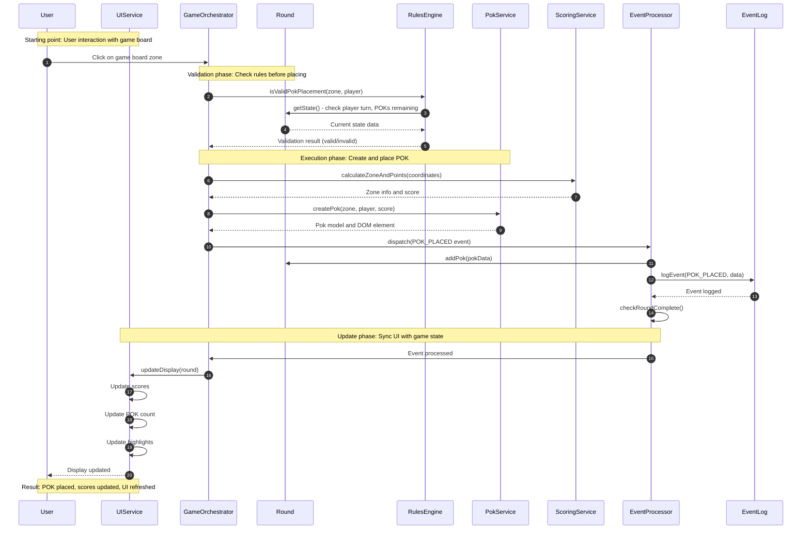
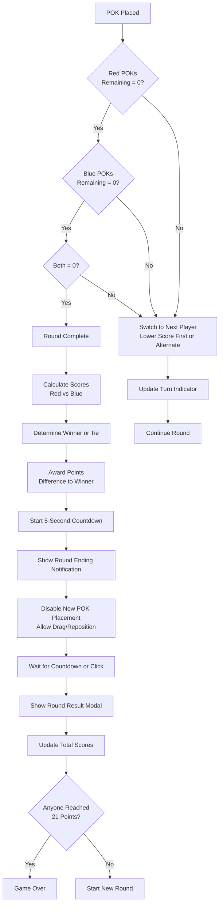
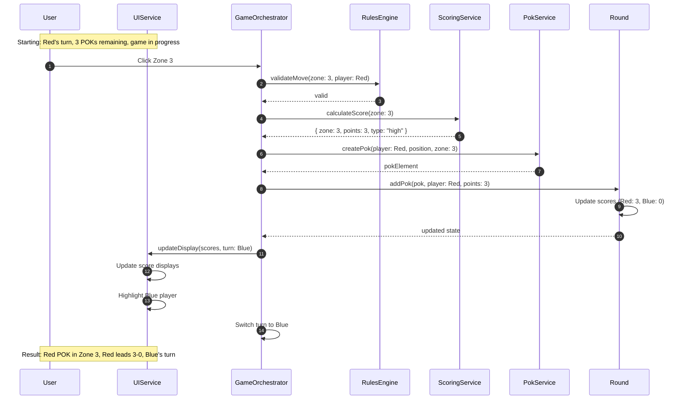
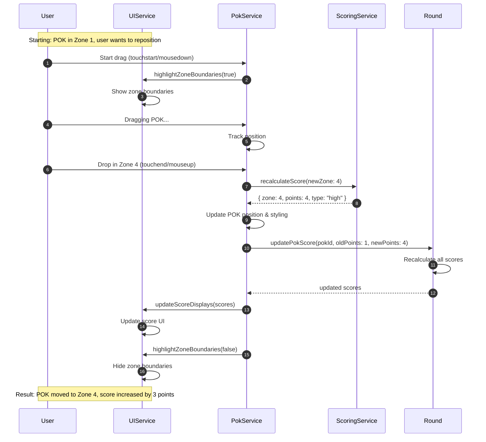
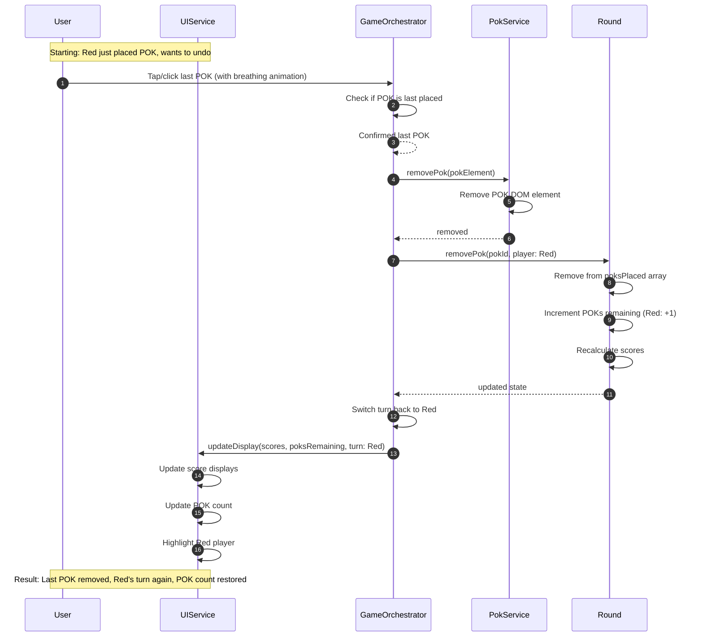
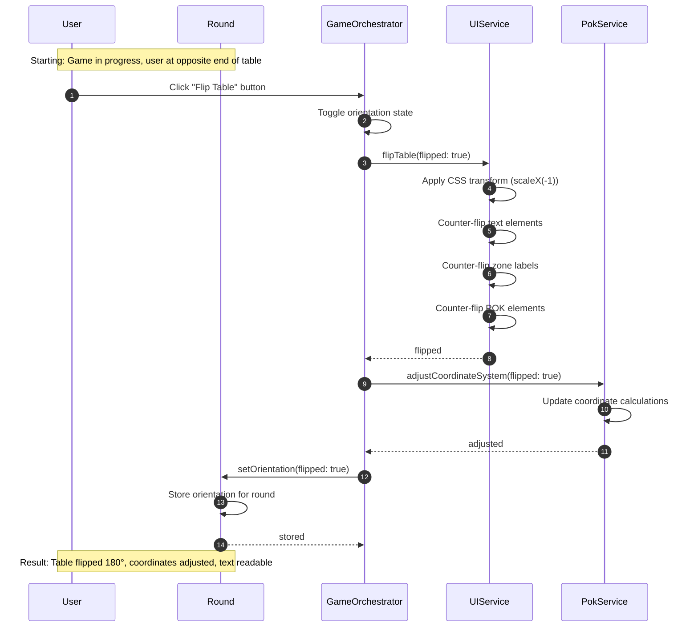
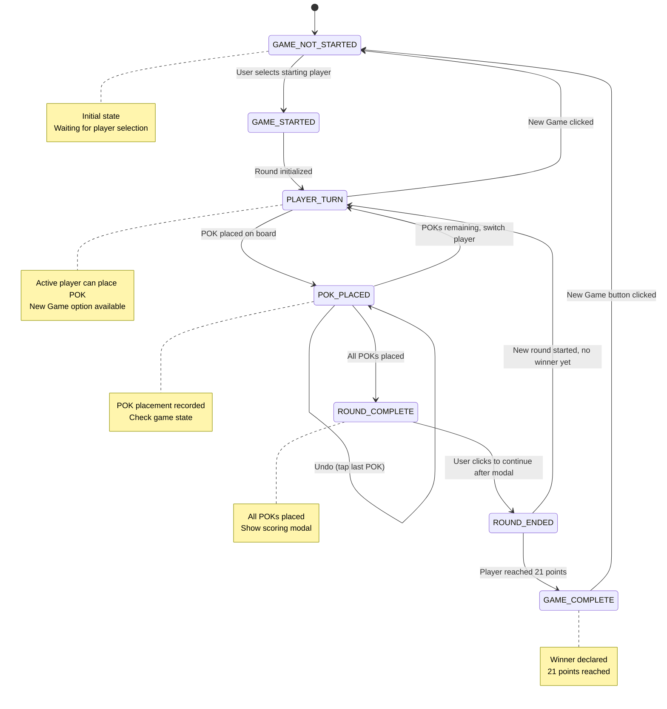

# POK Score Counter - System Architecture

## Table of Contents

1. [Overview](#overview)
2. [Configuration & Environment](#configuration--environment)
3. [High-Level Architecture](#high-level-architecture)
4. [Module Structure](#module-structure)
5. [Events & PubSub](#events--pubsub)
6. [Key Flows](#key-flows)
7. [Use Cases](#use-cases)
8. [State Machines](#state-machines)
9. [Component Breakdown](#component-breakdown)

---

## Overview

POK Score Counter is a browser-based digital scoring application for the POK table game.

**What it does:**
- Tracks scores for two-player POK games (Red vs Blue)
- Provides interactive game board for POK placement via touch or mouse
- Manages turn-based gameplay with automatic player switching
- Persists game state across browser sessions
- Supports drag-and-drop POK repositioning and undo functionality

**Primary use case:**
Digital replacement for manual scorekeeping during physical POK table games, allowing players to place virtual POKs on screen as they throw physical POKs.

**Key technologies:**
- Plain JavaScript (ES6+)
- HTML5
- CSS3
- LocalStorage API
- No external dependencies
- No build process required

---

## Configuration & Environment

### Game Rules Configuration

**Winning Conditions:**
- First player to 21 points wins
- Points awarded based on round score differences

**POKs Per Round:**
- Each player has 5 POKs per round
- Total 10 POKs placed per round

**Zone Scoring:**

| Zone ID | Points | Type | Boundary Behavior |
|---------|--------|------|-------------------|
| outer   | 0      | Outside table | No boundary |
| 0       | 0      | Center-right rectangle | No boundary |
| 1       | 1      | Rectangle | Boundary with zone 0 |
| 2       | 2      | Rectangle | Boundary with zone 1 |
| 3       | 3      | Rectangle (outermost) | Boundary with zone 2 |
| 4       | 4      | Top circle | Boundary with zone 1 |
| 5       | 5      | Bottom circle | Boundary with zone 1 |

**Boundary Rule:**
- POKs on zone boundaries score the lower zone's points
- 2% threshold for boundary detection

### UI Configuration

**Timing Constants:**

| Setting | Value | Purpose |
|---------|-------|---------|
| AUTO_END_ROUND_DELAY_MS | 5000 | Countdown before auto-ending round |
| PLAYER_TURN_NOTIFICATION_DURATION_MS | 1000 | Turn notification display time |
| HISTORY_RESTORE_DELAY_MS | 300 | Delay before showing historical POKs |
| TOUCH_DRAG_COOLDOWN_MS | 100 | Touch drag detection cooldown |
| TOUCH_DRAG_MOVE_THRESHOLD_PX | 5 | Minimum movement to trigger drag |

**Interaction Thresholds:**

| Setting | Value | Purpose |
|---------|-------|---------|
| BOUNDARY_THRESHOLD_PX | 15 | Visual boundary highlight distance |
| DEFAULT_POSITION_PERCENT | 50 | Default POK position (center) |

### External Dependencies

**None** - fully self-contained application

### Required Infrastructure

- Modern web browser with:
  - ES6+ JavaScript support
  - LocalStorage API
  - Touch event support (for mobile)
  - CSS transforms support

### Storage

**LocalStorage Key:**
- `pok-scorer-game-state` - stores complete game state

**Stored Data:**
- Game started status
- Player total scores
- All rounds with POK placements
- Current round index
- POK ID counter
- Table orientation per round

---

## High-Level Architecture



**Key Architectural Patterns:**
- Service-oriented architecture with clear separation of concerns
- Event-driven state management
- MVC-like separation (models, services, UI)
- State machine pattern for game flow control
- Coordinate all services through central orchestrator

---

## Module Structure

```
┌─────────────────────────────────────────────────────────────────────────┐
│                     app.js - Single File Application                    │
├─────────────────────────────────────────────────────────────────────────┤
│                                                                           │
│  [Constants & Configuration]                                             │
│    • GAME_CONFIG → winning score: 21, POKs per player: 5                │
│    • UI_CONFIG → animation timings, drag thresholds                      │
│    • ZONE_SCORES → 0-5 point zones mapping                               │
│    • EVENT_TYPES → game event type definitions                           │
│                                                                           │
├─────────────────────────────────────────────────────────────────────────┤
│  [Event System]                                                          │
│    ┌────────────────────────┐  ┌────────────────────────────────┐       │
│    │ GameEvent              │  │ EventLog                       │       │
│    │ • Event data structure │  │ • Records all game events      │       │
│    │ • Type, timestamp      │  │ • Maintains event history      │       │
│    └────────────────────────┘  └────────────────────────────────┘       │
│                                          ▲                                │
│                                          │ logs to                       │
├──────────────────────────────────────────┼───────────────────────────────┤
│  [State Management]                      │                               │
│    ┌─────────────────────────────────────┼───────────────────────┐       │
│    │ GameStateMachine                    │                       │       │
│    │ • Manages game state transitions                            │       │
│    │ • States: setup, playing, round_end, game_over              │       │
│    └─────────────────────────────────────────────────────────────┘       │
│                                          ▲                                │
│                                          │ controls                      │
├──────────────────────────────────────────┼───────────────────────────────┤
│  [Service Layer]                         │                               │
│    ┌──────────────────────┐  ┌──────────┼─────────────┐                 │
│    │ RulesEngine          │  │ ScoringService          │                 │
│    │ • Validates moves    │  │ • Zone detection        │                 │
│    │ • Turn order logic   │  │ • Point calculation     │                 │
│    └──────────────────────┘  └─────────────────────────┘                 │
│                                                                           │
│    ┌──────────────────────┐  ┌─────────────────────────┐                 │
│    │ PokService           │  │ UIService               │                 │
│    │ • POK creation       │  │ • DOM updates           │                 │
│    │ • Drag/drop handling │  │ • Animations            │                 │
│    │ • Positioning logic  │  │ • Notifications         │                 │
│    └──────────────────────┘  └─────────────────────────┘                 │
│                                                                           │
│    ┌──────────────────────────────────────────────────────────┐          │
│    │ PersistenceService                                       │          │
│    │ • Save/load game state to LocalStorage                   │          │
│    │ • State serialization/deserialization                    │          │
│    └──────────────────────────────────────────────────────────┘          │
│                      │                           │                       │
│                      │ manages                   │ persists              │
│                      ▼                           ▼                       │
├─────────────────────────────────────────────────────────────────────────┤
│  [Domain Models]                                                         │
│    ┌───────────────────┐  ┌──────────────────┐  ┌──────────────────┐    │
│    │ Game              │  │ Round            │  │ Player           │    │
│    │ • Manages rounds  │  │ • Tracks POKs    │  │ • Stores total   │    │
│    │ • Player refs     │  │ • Round scores   │  │   score          │    │
│    │ • Game state      │  │ • Completion     │  │ • Player ID      │    │
│    └───────────────────┘  └──────────────────┘  └──────────────────┘    │
│                                                                           │
│    ┌───────────────────┐  ┌──────────────────┐  ┌──────────────────┐    │
│    │ Pok               │  │ RoundScore       │  │ UIState          │    │
│    │ • Position (x,y)  │  │ • Red/blue scores│  │ • UI timers      │    │
│    │ • Points earned   │  │ • Round winner   │  │ • Drag state     │    │
│    │ • Zone number     │  │ • Point details  │  │ • Interactions   │    │
│    └───────────────────┘  └──────────────────┘  └──────────────────┘    │
│                                          ▲                                │
│                                          │ processes                     │
├──────────────────────────────────────────┼───────────────────────────────┤
│  [Event Processing]                      │                               │
│    ┌─────────────────────────────────────┼───────────────────────┐       │
│    │ EventProcessor                      │                       │       │
│    │ • Handles game events                                       │       │
│    │ • Applies state changes to models                           │       │
│    │ • Coordinates between services and domain models            │       │
│    └─────────────────────────────────────────────────────────────┘       │
│                                          ▲                                │
│                                          │ coordinates                   │
├──────────────────────────────────────────┼───────────────────────────────┤
│  [Orchestrator]                          │                               │
│    ┌─────────────────────────────────────┼───────────────────────┐       │
│    │ GameOrchestrator                    │                       │       │
│    │ • Coordinates all components                                │       │
│    │ • Handles user actions (place POK, end round, new game)     │       │
│    │ • Entry point for application logic                         │       │
│    └─────────────────────────────────────────────────────────────┘       │
│                                          │                                │
└──────────────────────────────────────────┼────────────────────────────────┘
                                           │
                                           ▼
                                  [Browser LocalStorage]
```

**Key Benefits:**
- Single-file deployment simplifies hosting
- Clear service boundaries enable isolated testing
- Event log provides debugging and audit trail
- Stateless services enable easy refactoring

**Why This Architecture:**
1. Separation of concerns prevents tangled dependencies
2. Service layer isolates complex logic (geometry calculations, rule validation)
3. Event system provides traceable state changes
4. State machine prevents invalid game states
5. Orchestrator provides single entry point for all user actions

---

## Events & PubSub

### Event Types

| Event | Payload | Purpose | WebSocket Event |
|-------|---------|---------|-----------------|
| GAME_STARTED | { startingPlayerId } | Game initialized with first player | N/A |
| GAME_RESET | {} | Game state cleared, return to start screen | N/A |
| ROUND_STARTED | { roundNumber, startingPlayerId } | New round begins | N/A |
| ROUND_ENDED | { roundNumber, winner, pointDifference } | Round complete, scores calculated | N/A |
| POK_PLACED | { pokId, playerId, zoneId, points, position } | POK placed on board | N/A |
| POK_MOVED | { pokId, oldZone, newZone, oldPoints, newPoints } | POK dragged to new position | N/A |
| POK_REMOVED | { pokId, playerId, points } | Last POK removed (undo) | N/A |
| PLAYER_SWITCHED | { fromPlayerId, toPlayerId } | Turn changes to next player | N/A |

**Note:** This is a client-side only application with no WebSocket or network communication.

### Event Flow



**Event Sources:**
- User interactions (clicks, touches, drags)
- Game state transitions (round complete, game over)
- Automated timers (auto-end round countdown)
- System actions (load saved game, flip table)

---

## Key Flows

### Phase Overview



### Phase Summary

| Phase | Type | Duration | Result | Status Transition |
|-------|------|----------|--------|-------------------|
| Input Capture | Synchronous | <10ms | Mouse/touch coordinates | N/A |
| Validation | Synchronous | <5ms | Valid/invalid placement | N/A |
| Zone Detection & Scoring | Synchronous | <10ms | Zone ID and points | N/A |
| POK Creation | Synchronous | <20ms | POK model and DOM element | POK_PLACED event |
| State Update | Synchronous | <10ms | Round scores updated | Check round complete |
| UI Sync | Synchronous | <50ms | Display refreshed | Turn switches |
| Round Ending | Async | 5000ms | Show countdown | ROUND_COMPLETE |
| Result Modal | User-triggered | Variable | Display winner | ROUND_ENDED |

**Key Characteristics:**
- Most operations are synchronous and complete in <100ms
- Only round ending phase uses async timer
- User can interrupt countdown by clicking
- All state changes produce events for debugging

### POK Placement Flow

```mermaid
flowchart TD
    phase1[PHASE 1: Input Capture]
    captureEvent[Mouse Click or Touch Event]
    calcCoords[Calculate Table-Relative Coordinates]
    accountFlip[Account for Table Flip Orientation]

    phase2[PHASE 2: Validation]
    checkGame{Game Started?}
    checkRound{Round Complete?}
    checkTurn{Current Player Turn?}
    checkRemaining{POKs Remaining?}
    rejectPlacement[Reject Placement]

    phase3[PHASE 3: Zone Detection & Scoring]
    convertCoords[Convert Pixel to Table Percentages]
    checkCircular[Check Circular Zones 4 or 5]
    checkRect[Check Rectangular Zones 0-3]
    calcBoundary[Calculate Boundary Proximity]
    determinePoints[Determine Points High/Low Score]
    boundaryRule[If on Boundary Award Lower Points]

    phase4[PHASE 4: POK Creation]
    genID[Generate Unique POK ID]
    createModel[Create Pok Model Object]
    createDOM[Create DOM Element with Styling]
    positionElement[Position Element on Table]
    makeDraggable[Make Element Draggable]

    phase5[PHASE 5: State Update]
    addToArray[Add POK to Round.poksPlaced Array]
    updateScores[Update Round Scores]
    decrementCount[Decrement POKs Remaining]
    markLast[Mark POK as Last Placed for Undo]
    recordEvent[Record POK_PLACED Event]

    phase6[PHASE 6: UI Sync]
    updateDisplay[Update Score Displays]
    updateCount[Update POK Count]
    highlightLast[Highlight Last Placed POK]
    switchTurn[Switch Player Turn Indicator]
    saveState[Save Game State to LocalStorage]

    done[Placement Complete]

    phase1 --> captureEvent
    captureEvent --> calcCoords
    calcCoords --> accountFlip
    accountFlip --> phase2

    phase2 --> checkGame
    checkGame -->|No| rejectPlacement
    checkGame -->|Yes| checkRound
    checkRound -->|Yes| rejectPlacement
    checkRound -->|No| checkTurn
    checkTurn -->|No| rejectPlacement
    checkTurn -->|Yes| checkRemaining
    checkRemaining -->|No| rejectPlacement
    checkRemaining -->|Yes| phase3

    phase3 --> convertCoords
    convertCoords --> checkCircular
    checkCircular --> checkRect
    checkRect --> calcBoundary
    calcBoundary --> determinePoints
    determinePoints --> boundaryRule
    boundaryRule --> phase4

    phase4 --> genID
    genID --> createModel
    createModel --> createDOM
    createDOM --> positionElement
    positionElement --> makeDraggable
    makeDraggable --> phase5

    phase5 --> addToArray
    addToArray --> updateScores
    updateScores --> decrementCount
    decrementCount --> markLast
    markLast --> recordEvent
    recordEvent --> phase6

    phase6 --> updateDisplay
    updateDisplay --> updateCount
    updateCount --> highlightLast
    highlightLast --> switchTurn
    switchTurn --> saveState
    saveState --> done
```



---

## Use Cases

### Use Case 1: Place POK (Normal Flow)



### Use Case 2: Drag POK to Different Zone



### Use Case 3: Undo Last POK



### Use Case 4: Flip Table Orientation



**Edge Cases Handled:**
- Dragging POK out of table bounds (placed in outer zone, 0 points)
- Multiple rapid taps on last POK (only first tap triggers undo)
- Clicking during round-ending countdown (cancels timer, shows modal immediately)
- Loading saved game with invalid state (falls back to new game)
- Flipping table mid-drag (coordinates recalculated on-the-fly)

---

## State Machines

### Game State Transitions

**Turn switching is not permitted when:**
- Round has not started
- Round is complete (all POKs placed)
- Game is showing round result modal

**Player turn determination:**
- Player with lower total score goes first in each round
- If scores tied, players alternate turns
- If one player has no POKs remaining, other player places all remaining POKs

**Not Supported:**
- Simultaneous POK placement by both players
- Skipping turns
- Placing more than 5 POKs per player per round

### State Summary

| State | Red POKs Left? | Blue POKs Left? | Allowed Actions |
|-------|---------------|-----------------|-----------------|
| GAME_NOT_STARTED | N/A | N/A | Select starting player, load saved game |
| GAME_STARTED | 5 | 5 | Place POK (current player) |
| PLAYER_TURN | 1-5 | 1-5 | Place POK, undo last POK, new game |
| POK_PLACED | 0-5 | 0-5 | Drag POK, undo last POK |
| ROUND_COMPLETE | 0 | 0 | Drag POK (adjustment period) |
| ROUND_ENDED | N/A | N/A | View scores, continue to next round |
| GAME_COMPLETE | N/A | N/A | View final scores, start new game |



**Rationale:**
- State machine prevents invalid transitions (e.g., placing POK when round complete)
- Clear state boundaries enable proper UI updates
- Undo functionality maintains state consistency by reverting to previous valid state

---

## Component Breakdown

### GameOrchestrator

**Purpose:**
Central coordinator that handles all user actions and orchestrates service interactions.

**Responsibilities:**
- Receive user input events (clicks, touches, button presses)
- Coordinate validation, scoring, and state updates
- Manage game lifecycle (start, reset, save/load)
- Delegate UI updates to UIService
- Trigger event recording via EventProcessor
- Handle special actions (undo, flip table, export)

**Dependencies:**
- All service layer components (RulesEngine, ScoringService, PokService, UIService, PersistenceService)
- EventProcessor for event dispatching
- GameStateMachine for state validation
- Game domain model

**Interfaces:**
- `startGame(playerId)` - initialize new game
- `placePok(event)` - handle POK placement from click/touch
- `handlePokDrag(pokElement, event)` - manage POK repositioning
- `undoLastPok()` - remove last placed POK
- `endRound()` - complete current round and show results
- `continueToNextRound()` - start new round after result modal
- `flipTable()` - toggle table orientation
- `exportMatch()` - download game state as JSON
- `importMatch(file)` - load game state from JSON

### RulesEngine

**Purpose:**
Validates game actions according to POK rules.

**Responsibilities:**
- Check if POK placement is legal for current player
- Determine next player based on scores and POKs remaining
- Calculate round starter (winner of previous round or alternating if tie)
- Validate game over conditions (21 points reached)
- Calculate round winner and points awarded

**Dependencies:**
- Game and Round domain models (read-only)

**Interfaces:**
- `canPlacePok(round, playerId)` - validate POK placement
- `getNextPlayer(round)` - determine whose turn is next
- `getRoundStarter(previousRound)` - determine round starting player
- `shouldEndGame(game)` - check if game is complete
- `calculateRoundWinner(round)` - determine round outcome

### ScoringService

**Purpose:**
Handles zone detection and point calculation based on POK positions.

**Responsibilities:**
- Convert pixel coordinates to table-relative percentages
- Detect which zone contains a given position
- Calculate circular zone membership (zones 4 and 5)
- Calculate rectangular zone membership (zones 0-3)
- Apply boundary rules (POK on line scores lower zone)
- Account for table aspect ratio (1.5:1) in calculations

**Dependencies:**
- ZONE_SCORES configuration
- UI_CONFIG for boundary thresholds

**Interfaces:**
- `getZoneAtPosition(tableXPercent, tableYPercent)` - returns zone ID, points, high/low score, boundary zone
- `getZoneElement(zoneId)` - returns DOM element for zone highlighting
- `checkCircularZone(x, y, center, radius, zoneId, boundaryZone)` - circular zone detection
- `checkRectangularZone(x, rightBoundary, zoneId, boundaryZone)` - rectangular zone detection

### PokService

**Purpose:**
Manages POK lifecycle (creation, positioning, dragging, removal).

**Responsibilities:**
- Generate unique POK IDs
- Create Pok domain models
- Create and style POK DOM elements
- Position POKs on table using percentage coordinates
- Handle drag-and-drop for both mouse and touch
- Convert event coordinates to table-relative percentages
- Account for table flip when calculating positions
- Highlight last placed POK with animation
- Remove POKs from DOM

**Dependencies:**
- Game table DOM element reference
- ScoringService for zone detection during drag

**Interfaces:**
- `setTableElement(element)` - set reference to game board
- `generatePokId()` - create unique ID
- `createPok(playerId, points, x, y, zoneId, isHighScore)` - create model
- `createPokElement(pok)` - create DOM element
- `attachPokToTable(pokElement)` - add to DOM
- `makePokDraggable(pokElement, callbacks)` - enable drag-and-drop
- `calculateTablePositionFromEvent(event)` - convert coordinates
- `removePokElement(pokId)` - remove from DOM
- `highlightAsLastPlaced(pokElement)` - add breathing animation
- `clearLastPlacedHighlight()` - remove all highlights

### UIService

**Purpose:**
Handles all DOM manipulation and visual updates.

**Responsibilities:**
- Update score displays (total and round scores)
- Update POK count indicators
- Show/hide player turn notifications
- Display round end modal with results
- Update rounds history table
- Manage start screen visibility
- Show zone boundary highlights during drag
- Apply table flip CSS transform
- Handle animations (fade-ins, breathing effects)
- Display countdown timer during round ending

**Dependencies:**
- DOM elements (cached references)
- UI_CONFIG for timing constants
- Game and Round models (read-only)

**Interfaces:**
- `init()` - cache DOM element references
- `updateScores(game)` - refresh all score displays
- `updateCurrentPlayer(round)` - change turn indicator
- `showRoundModal(winner, scores, totals, roundNumber)` - display results
- `hideRoundModal()` - close results modal
- `updateRoundsHistory(game)` - refresh history table
- `showPlayerTurnNotification(playerId)` - display turn change
- `showRoundCompleteNotification(secondsRemaining)` - countdown display
- `highlightZoneBoundary(zoneElement)` - show boundary during drag
- `clearAllZoneBoundaryHighlights()` - remove all highlights
- `disableZoneInteractions()` - prevent POK placement during round ending
- `enableZoneInteractions()` - re-enable POK placement

### PersistenceService

**Purpose:**
Manages game state persistence to LocalStorage.

**Responsibilities:**
- Serialize complete game state to JSON
- Save serialized state to LocalStorage
- Load and deserialize saved game state
- Clear saved state when starting new game
- Check if saved game exists

**Dependencies:**
- Game and Round models for serialization
- PokService for POK ID counter state
- LocalStorage API

**Interfaces:**
- `saveGameState(game, orchestrator)` - persist to storage
- `loadGameState()` - retrieve from storage
- `clearGameState()` - delete saved state
- `hasGameState()` - check if save exists

### EventProcessor

**Purpose:**
Processes game events and applies state changes to domain models.

**Responsibilities:**
- Receive events from orchestrator
- Validate state transitions via GameStateMachine
- Apply state changes to Game and Round models
- Log all events to EventLog
- Check for round completion and game over
- Coordinate between services during event processing

**Dependencies:**
- Game, Round, Player, Pok domain models
- EventLog for recording
- GameStateMachine for validation
- All services for event execution

**Interfaces:**
- `process(event)` - handle event and apply changes
- `applyEvent(event)` - execute specific event type
- `handleGameStarted(event)` - process game start
- `handlePokPlaced(event)` - process POK placement
- `handlePokMoved(event)` - process POK drag
- `handlePokRemoved(event)` - process undo
- `handlePlayerSwitched(event)` - process turn change
- `handleRoundEnded(event)` - process round completion
- `handleGameReset(event)` - process new game

### EventLog

**Purpose:**
Records and maintains history of all game events.

**Responsibilities:**
- Store events with timestamps
- Provide event history for debugging
- Enable event replay for testing
- Print event summaries
- Export event log as JSON

**Dependencies:**
- GameEvent for event structure

**Interfaces:**
- `record(event)` - add event to log
- `getAll()` - retrieve all events
- `clear()` - reset log
- `export()` - serialize log to JSON
- `printSummary()` - display event counts

### GameStateMachine

**Purpose:**
Enforces valid game state transitions.

**Responsibilities:**
- Track current game state
- Define allowed state transitions
- Validate transition requests
- Log state changes
- Prevent invalid state flows

**Dependencies:**
- None (stateless logic)

**Interfaces:**
- `canTransition(eventType)` - check if transition allowed
- `transition(newState)` - change state
- `setState(state)` - set state directly (for loading)
- `getState()` - get current state

### Domain Models

**Game:**
- Manages overall game state, players, rounds
- Tracks winning score and current round
- Methods: `startNewGame()`, `startNewRound()`, `getCurrentRound()`, `reset()`, `hasWinner()`

**Round:**
- Tracks single round state, POKs placed, scores
- Manages POKs remaining per player
- Methods: `addPok()`, `removePok()`, `isRoundComplete()`, `recalculateScores()`, `switchPlayer()`

**Player:**
- Stores player ID and total score
- Methods: `addScore()`, `resetScore()`

**Pok:**
- Represents single POK with position, zone, points
- Methods: `updatePosition()`, `updateScore()`, `updateZone()`

**RoundScore:**
- Calculates and tracks round scores for both players
- Methods: `addPoints()`, `updateWinner()`

**UIState:**
- Manages UI-specific state (timers, drag state)
- Methods: `setAutoEndTimer()`, `clearAutoEndTimer()`, `setCountdownInterval()`, `clearCountdownInterval()`

---

*Generated with [Claude Code](https://claude.com/claude-code)*
